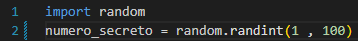

# Projeto-JogoDe_adivinhacao
 Projeto de um jogo de adivinhação onde tem uma interração Web 

Inicio do projeto dia 18/09
. Foi feito a importação da biblioteca random podendo assim gerar um número aleatorio
    

    
    

. introduzimos o loop While para que possamos conduzir as tentativas e a confirmação do acerto 
Pois a condição continuara enquanto não for verdadeiro(True)

 Dia 19/09
Estou aqui para adicionar algumas palavras abreviadas para subir meu README ou alguma aplicação 
-Atualização (ATZ) = Seria de forma geral 
-Update version (UPV) = Seria atualização unicamente do sistema 

