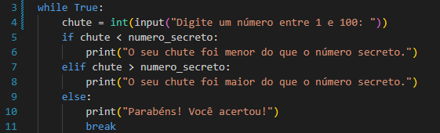

# Projeto-JogoDe_adivinhacao
 Projeto de um jogo de adivinhação onde tem uma interração Web 

    Inicio do projeto dia 18/09

. Foi feito a importação da biblioteca random podendo assim gerar um número aleatorio

função para gerar numero aleatorio

random.randint gerar o numero e agrega na variavel numero_secreto

    

    
    

. introduzimos o loop While para que possamos conduzir as tentativas e a confirmação do acerto

Pois a condição continuara enquanto não for verdadeiro(True)

     Dia 19/09

Estou aqui para adicionar algumas palavras abreviadas para subir meu README ou alguma aplicação

-Atualização (ATZ) = Seria de forma geral

-Update version (UPV) = Seria atualização unicamente do sistema
 
    

    
    

Aqui inicia o loop(While) até que a condição seja verdadeira(Ou seja que jogador acerte o número secreto).

O meu INPUT vai pedir o jogador para inserir um valor inteiro(str) no console a minha função INT convertera a string para número inteiro e guarda na variavel CHUTE

